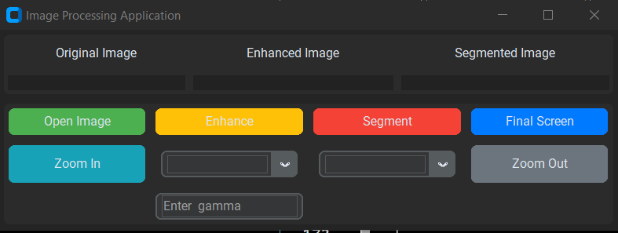
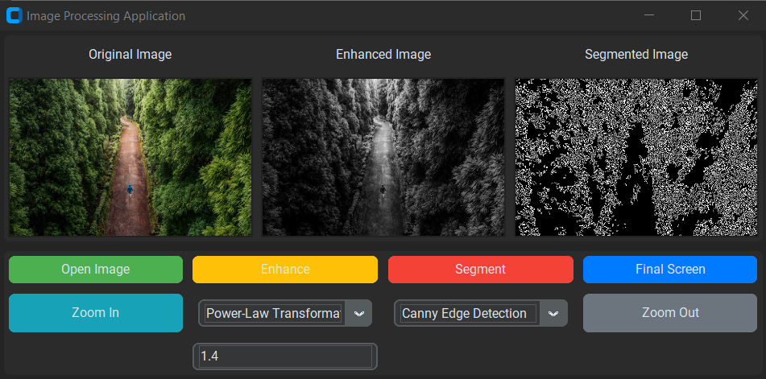

# Image Processing Application

This is a Python-based Image Processing Application built using `customtkinter`, `tkinter`, `ttkbootstrap`, and `opencv-python`. The application provides various image processing functionalities like loading an image, enhancing it using different techniques, segmenting the image, and zooming in/out.

## Features

- **Load Image**: Open and display an image.
- **Enhance Image**: Enhance the image using techniques like Negative Transformation, Thresholding, Log Transformation, Power-Law Transformation, Piecewise Linear Transformation, Gray Level Slicing, and Bit Plane Slicing.
- **Segment Image**: Segment the image using techniques like Thresholding, Canny Edge Detection, Region Growing Segmentation.
- **Zoom In/Out**: Zoom in and out of the image.
- **Display Final Screen**: Display the original image alongside the processed images.

## Requirements

- Python 3.x
- `customtkinter`
- `tkinter`
- `ttkbootstrap`
- `opencv-python`
- `Pillow`

## Installation

1. Clone the repository:
    ```bash
    git clone https://github.com/yourusername/image-processing-app.git
    cd image-processing-app
    ```

2. Create a virtual environment and activate it:
    ```bash
    python -m venv venv
    source venv/bin/activate   # On Windows use `venv\Scripts\activate`
    ```

3. Install the required packages:
    ```bash
    pip install customtkinter tkinter ttkbootstrap opencv-python Pillow
    ```

## Usage

1. Run the application:
    ```bash
    python app.py
    ```

2. Use the interface to load an image, apply enhancements, segmentations, and zoom functionalities.

## Code Overview

The main file `app.py` contains the implementation of the Image Processing Application. The main class `ImageProcessingApp` manages the GUI and image processing functionalities.

### Main Functions

- `load_image()`: Load and display the selected image.
- `Zoom_In()`: Zoom in on the image.
- `Zoom_Out()`: Zoom out of the image.
- `enhance_image()`: Apply the selected enhancement technique.
- `segment_image()`: Apply the selected segmentation technique.
- `display_image(image, label_widget)`: Display the image in the specified label widget.
- `log_transformation(image_gray)`: Apply log transformation.
- `power_law_transformation(image_gray, gamma)`: Apply power-law transformation.
- `piecewise_linear_transformation(image_gray)`: Apply piecewise linear transformation.
- `gray_level_slicing(image_gray)`: Apply gray level slicing.
- `bit_plane_slicing(image_gray)`: Apply bit plane slicing.
- `region_growing_segmentation()`: Apply region growing segmentation.
- `region_growing(image, seed_point, threshold)`: Helper function for region growing segmentation.
- `display_final_screen()`: Display the final screen with all processed images.

## Screenshots




## Contributing

1. Fork the repository.
2. Create a new branch:
    ```bash
    git checkout -b feature/your-feature-name
    ```
3. Make your changes.
4. Commit your changes:
    ```bash
    git commit -m 'Add some feature'
    ```
5. Push to the branch:
    ```bash
    git push origin feature/your-feature-name
    ```
6. Create a new Pull Request.


Feel free to improve the documentation and functionality of the application.
